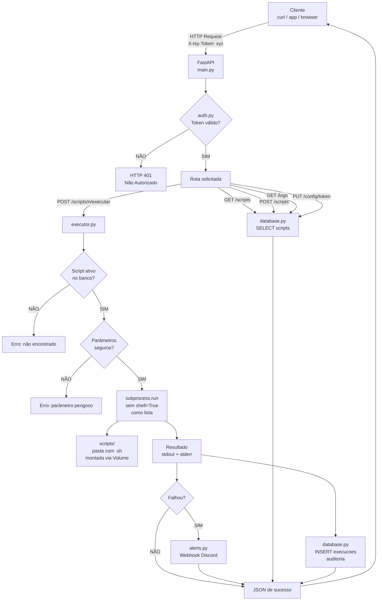

# Diagrama de Arquitetura do IsyShell

## Fluxo de Requisição



## Componentes e Responsabilidades

```
┌─────────────────────────────────────────────────────────────────┐
│                        CONTAINER DOCKER                          │
│                                                                   │
│  ┌─────────────┐    ┌──────────┐    ┌──────────────────────┐    │
│  │   main.py   │───▶│  auth.py │    │     executor.py      │    │
│  │  (roteador) │    │ (porteiro)│    │  (operário seguro)   │    │
│  └──────┬──────┘    └──────────┘    │  • Valida parâmetros │    │
│         │                           │  • subprocess lista  │    │
│         │           ┌──────────┐    │  • Sem shell=True    │    │
│         ├──────────▶│schemas.py│    └──────────┬───────────┘    │
│         │           │(moldes)  │               │                │
│         │           └──────────┘               ▼                │
│         │                           ┌─────────────────────┐     │
│         │           ┌──────────┐    │   /scripts/ VOLUME  │     │
│         ├──────────▶│ alerts.py│    │   limpar_logs.sh    │     │
│         │           │(Discord) │    │   checar_docker.sh  │     │
│         │           └──────────┘    └─────────────────────┘     │
│         │                                                         │
│         ▼                                                         │
│  ┌─────────────────────────────────────────────────────────┐    │
│  │              database.py — SQLite                        │    │
│  │  ┌──────────┐  ┌─────────────┐  ┌──────────────────┐   │    │
│  │  │ scripts  │  │  execucoes  │  │  configuracoes   │   │    │
│  │  │(cadastro)│  │ (auditoria) │  │  (token, etc.)   │   │    │
│  │  └──────────┘  └─────────────┘  └──────────────────┘   │    │
│  └─────────────────────────────────────────────────────────┘    │
│                                /app/data/isyshell.db             │
└─────────────────────────────────────────────────────────────────┘
                                         │
                                    HOST (sua máquina)
                                    ./data/isyshell.db  (persistido)
                                    ./scripts/*.sh      (editável)
```
