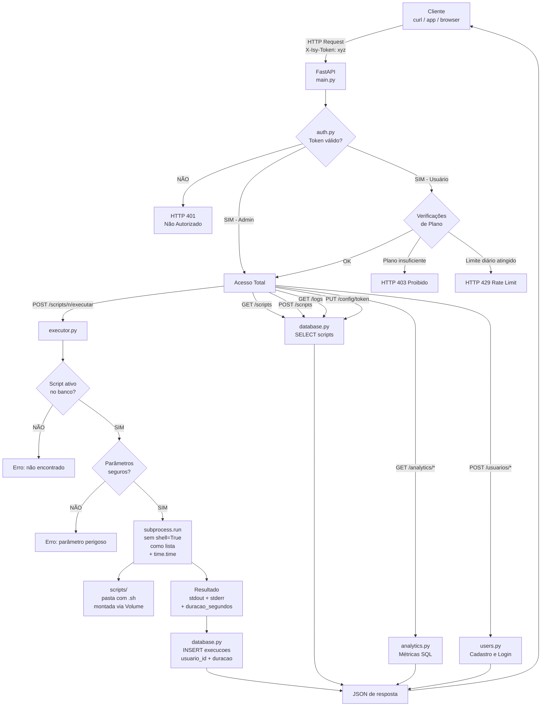

# Diagrama de Arquitetura do IsyShell

## Fluxo de Requisição



---

## Componentes e Responsabilidades

```
┌──────────────────────────────────────────────────────────────────────┐
│                          CONTAINER DOCKER                             │
│                                                                        │
│  ┌─────────────┐    ┌───────────┐    ┌─────────────────────────┐     │
│  │   main.py   │───▶│  auth.py  │    │      executor.py        │     │
│  │  (roteador) │    │(porteiro) │    │  • Valida parâmetros    │     │
│  └──────┬──────┘    └───────────┘    │  • subprocess como lista│     │
│         │                            │  • Sem shell=True       │     │
│         │           ┌───────────┐    │  • Mede duracao_segundos│     │
│         ├──────────▶│schemas.py │    └──────────┬──────────────┘     │
│         │           │ (moldes)  │               │                     │
│         │           └───────────┘               ▼                     │
│         │                            ┌────────────────────┐           │
│         │           ┌───────────┐    │  /scripts/ VOLUME  │           │
│         ├──────────▶│ users.py  │    │  limpar_logs.sh    │           │
│         │           │(freemium) │    │  checar_docker.sh  │           │
│         │           └───────────┘    └────────────────────┘           │
│         │                                                              │
│         │           ┌───────────┐                                      │
│         ├──────────▶│analytics.py│                                     │
│         │           │(métricas) │                                      │
│         │           └───────────┘                                      │
│         │                                                              │
│         │           ┌───────────┐                                      │
│         └──────────▶│payments.py│◀── POST /webhooks/stripe             │
│                     │ (Stripe)  │        (Stripe envia aqui)           │
│                     └───────────┘                                      │
│                                                                        │
│  ┌──────────────────────────────────────────────────────────────┐     │
│  │                  database.py — SQLite                         │     │
│  │  ┌──────────┐  ┌────────────────────────┐  ┌─────────────┐  │     │
│  │  │ scripts  │  │       execucoes         │  │ configuracoes│  │     │
│  │  │(cadastro)│  │ usuario_id, duracao_seg │  │(token admin)│  │     │
│  │  │plano_min │  │ stdout, stderr, status  │  └─────────────┘  │     │
│  │  └──────────┘  └────────────────────────┘                    │     │
│  │  ┌──────────────────────────────────────┐                    │     │
│  │  │              usuarios                │                    │     │
│  │  │  email, senha_hash, plano, token     │                    │     │
│  │  └──────────────────────────────────────┘                    │     │
│  └──────────────────────────────────────────────────────────────┘     │
│                          /app/data/isyshell.db                         │
└──────────────────────────────────────────────────────────────────────┘
                                    │
                               HOST (sua máquina)
                               ./data/isyshell.db  (persistido)
                               ./scripts/*.sh      (editável sem rebuild)
```
